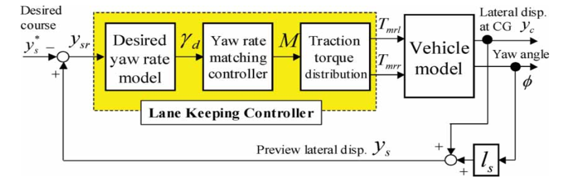

# Lane-keeping-controller

Matlab simulation for lane keeping controller.
Based on https://doi.org/10.1080/00423110600870006
"Lane keeping control strategy with direct yaw moment control input by considering dynamics of electric vehicle"

## Trajectory

## Dependencies

- Matlab version >= 2019a 

## Execution:

- Execute: values_of_car.m
- Execute: lane_keeping_control_system_by_DYC_block_diagram.slx

To show the results:
- Execute: results_plot.m 

## Layout

Taken from https://doi.org/10.1080/00423110600870006

